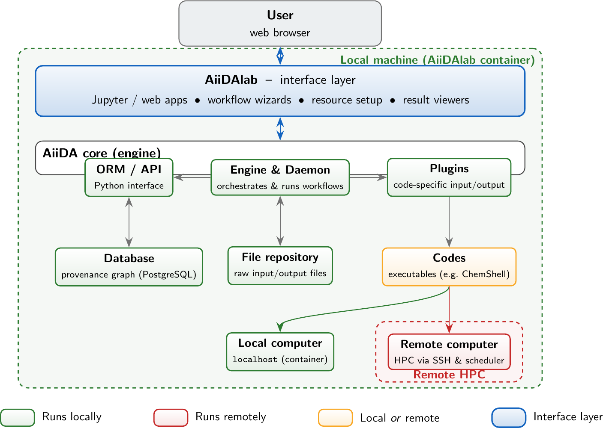

AiiDA & AiiDAlab: How They Work Together
========================================

A short overview of the AiiDAlab interface layer and the AiiDA components
beneath it.

Overview
--------

**AiiDA** (Automated Interactive Infrastructure and Database for Computational
Science) is a workflow management engine that runs, tracks, and stores
computational science calculations while preserving their full provenance.
**AiiDAlab** sits *directly on top* of AiiDA as a browser-based interface
layer: it turns AiiDA's Python API into a collection of interactive Jupyter/web
applications (*plugins/apps*) so that users can configure resources, submit
workflows, and inspect results without writing code.

In short: **AiiDAlab is what the user sees and clicks; AiiDA is the engine that
actually orchestrates and records the work.** Everything AiiDAlab does is
ultimately a call into AiiDA.

Flow Diagram
------------

   AiiDAlab is a thin interface layer on top of the AiiDA engine. The engine,
   its API/ORM, plugins, database, and file repository all live on the local
   machine (inside the AiiDAlab container). Codes and plugins are used for work
   that may run either locally or on a remote HPC, and computers are the actual
   execution targets: ``localhost`` inside the container, or a remote cluster
   reached over SSH.

Key Components
--------------

AiiDAlab
   The interface layer. A set of browser-based apps (served from a container)
   that expose AiiDA functionality — setting up resources, building and
   submitting workflows, and visualising results — without requiring the user
   to write Python. *Contains its own application store for installing and
   managing specific applications.*

Engine & Daemon
   The heart of AiiDA. The daemon is a long-running local process that picks up
   submitted workflows/calculations, drives them through their steps, submits
   jobs to computers, and records everything. *Local.*

ORM / API
   The Python object layer through which AiiDAlab (and users) create nodes,
   query data, and submit work. *Local.*

Plugins
   Code-specific adapters that know how to write the input files for a given
   program and parse its output back into AiiDA data nodes (e.g. the ChemShell
   plugin). They are installed *locally* either via an AiiDAlab application
   plugin (as a Python dependency) or individually through PyPI/conda-forge.

Codes
   AiiDA's representation of an executable (e.g. ``chemsh``). Each code is
   attached to a computer, so a code can point at a *local* executable (e.g.
   ``chemsh@localhost``) *or* an executable on a remote HPC. Codes can be
   autoconfigured as part of the AiiDAlab application to simplify user
   accessibility, though it can become more difficult for more complex codes.

Database
   A PostgreSQL database storing the provenance graph — every calculation, its
   inputs, outputs, and how they connect. *Local* (inside the container / on the
   machine running AiiDA).

File repository
   On-disk storage for the raw input and output files referenced by the database
   nodes. *Local.*

Local computer
   The ``localhost`` execution target inside the AiiDAlab container. Used for
   lightweight jobs or bundled codes such as a containerised ChemShell
   installation.

Remote computer
   An external HPC cluster registered with AiiDA. Reached over SSH, with jobs
   submitted through the machine's scheduler (e.g. SLURM). *Remote.*

Key Development Considerations
------------------------------

- All AiiDA plugins must be available through PyPI.
- All AiiDAlab applications should be available through the AiiDAlab app registry
  and run independently of locally configured software.
- All ``aiida*`` plugins and ``aiidalab*`` apps must not depend on the specific
  software backend (i.e. minimal Python dependency tree).
- All data must be storable as an AiiDA data node to enable interaction between
  software.
- Pre-bundled containerised deployments should be avoided where possible, relying
  on existing AiiDAlab UI components instead.

Further reading
---------------

- `AiiDA documentation <https://aiida.readthedocs.io>`_
- `AiiDAlab documentation <https://aiidalab.readthedocs.io>`_
