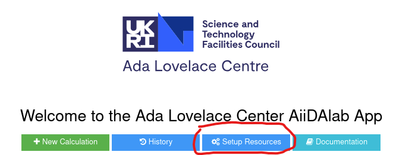
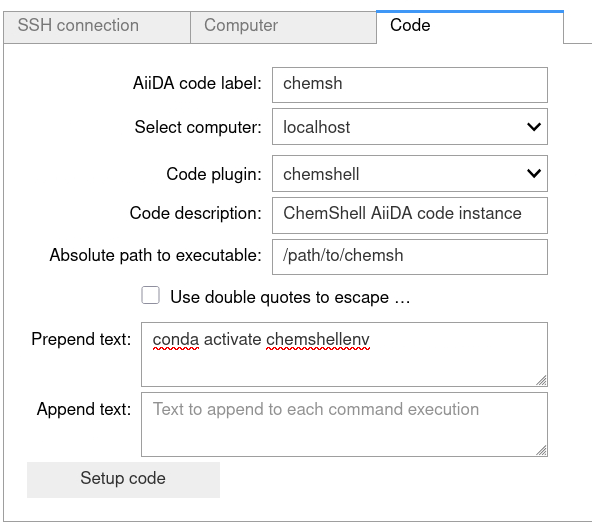

.. _resource_management:

AiiDAlab Code Setup
===================

This guide details how to setup code instances from within the AiiDAlab interface for 
running custom software packages as part of the AiiDA workflow on both the local and remote 
machines. 

Introduction
------------

AiiDA requires `code <https://aiida.readthedocs.io/projects/aiida-core/en/stable/howto/run_codes.html#how-to-create-a-code>`_ 
and `computer <https://aiida.readthedocs.io/projects/aiida-core/en/stable/howto/run_codes.html#how-to-set-up-a-computer>`_ 
instances to be able to run external software as part of the AiiDA workflow. Whilst it is 
possible to setup and manage these via the AiiDA provided command line interface, AiiDAlab 
provides a graphical interface for the same tasks. Whilst this interface is hidden by the 
default AiiDAlab home application it can be accessed via the AiiDAlab ALC app from the 
*Setup Resources* button on the navigation bar, 

This will bring up the AiiDAlab Code setup page from which computer and code instances 
can be setup. 

Local Computer Instance
-----------------------

The AiiDAlab application comes with access to the local computer as default. This is given the 
name *localhost* and any locally installed software can be accessed by setting up a code 
instance based on this computer instance. This generally only includes software that has been 
installed within the container running the AiiDAlab application, however through binding/mounting
an external volume into the container additional binaries already present on the local machine could
be made available within the container.

Remote Computer Instance
------------------------

For more computationally expensive tasks it is recommended to setup a connection to a remote 
HPC cluster where the scientific software will be hosted. AiiDA provides access to remote 
computers via the SSH protocol using SSH key based authentication (*password based authentication
is not fully supported*). More information on how AiiDA communicates via SSH can be found in the 
`AiiDA documentaion <https://aiida.readthedocs.io/projects/aiida-core/en/stable/howto/ssh.html>`_

From the AiiDAlab code setup page a remote computer instance can be setup as follows,

#.  First ensure that the check box for step by step resource setup is checked which will expand the
    setup page to show a selection of tabs for setting up SSH connections, computers and code instances.

    .. figure:: ../../../images/Resource_Setup_CheckBox.png
        :width: 50%
        :alt: checkbox to setup resource step by step 
        :figclass: centre-fig 

#.  From here select the **Computer** tab which will bring up a number of options for configuring the 
    remote computer instance 

#.  Fill in the required configuration options which are described in more detail 
    `here <https://aiida.readthedocs.io/projects/aiida-core/en/stable/howto/run_codes.html#how-to-set-up-a-computer>`_\.
    The following figure shows an example for connecting to SCARF utilising the inbuilt AiiDA 
    SLURM scheduler plugin. 

    .. figure:: ../../../images/scarf_setup_example.png
        :width: 60%
        :alt: Example setup for SCARF 
        :figclass: centre-fig 

#.  Once the required configuration has been filled in the *Setup computer* and *Test computer* 
    buttons can be used to setup the AiiDA computer instance and test the SSH connection. 

This assumes that you already have an SSH configuration for the remote machine setup i.e. SSH key access
to the remote machine with the configuration available within the ``.ssh/`` directory in you home space.
If this is not the case the *SSH connection* tab can help set this up and would need to be carries out before
setting up the computer instance.

Setup Code Instance
-------------------

The **Code** tab enables the creation of AiiDA code instances which utilise AiiDA plugin to call 
external software packages for computation. More details about how these work within the AiiDA 
workflow can be found `here <https://aiida.readthedocs.io/projects/aiida-core/en/stable/howto/run_codes.html#how-to-create-a-code>`_\.
To setup a AiiDA code instance you need to provide the following components:

- *Label* - A label to be given to the code instance.
- *Computer* - The AiiDA computer instance the code will run on.
- *Plugin* - The associated AiiDA plugin for the software.
- *Description* - A more detailed description to be associated with the code instance.
- *Path to executable* - The absolute path to the executable for the external software.
- *Prepend text* - Any commands which need to be run before the executable such as module or environment loading.
- *Append text* - Any command which need to be run after the executable.

Once setup the code should appear in the list of *Available Codes* at the bottom of the page. A 
refresh might be required for it to show. An example for setting up a code instance to run the 
`ChemShell <https://github.com/stfc/aiida-chemshell>`_ software is given below.

